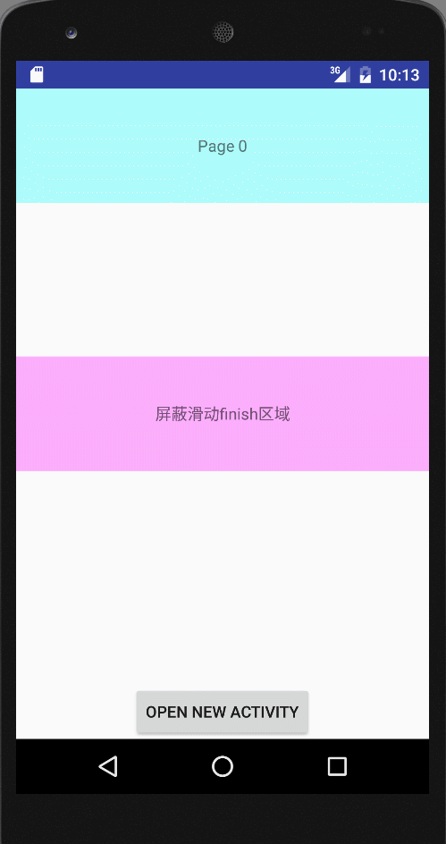

# SlideFinishDemo
右滑退出当前页面的Demo

效果如下：

**思路分析：**
将android的顶层view替换为自定义的view，在其中重写事件分发与滑动事件触发右滑退出的条件与时机。
考虑到子view可能是`ViewPager`、`HorizontalScrollView`等自身有横向滑动属性的控件，可以对这些控件单独处理，或者开一个手动添加忽略右滑退出子view的接口。

更详细的介绍可以看代码中的注释。